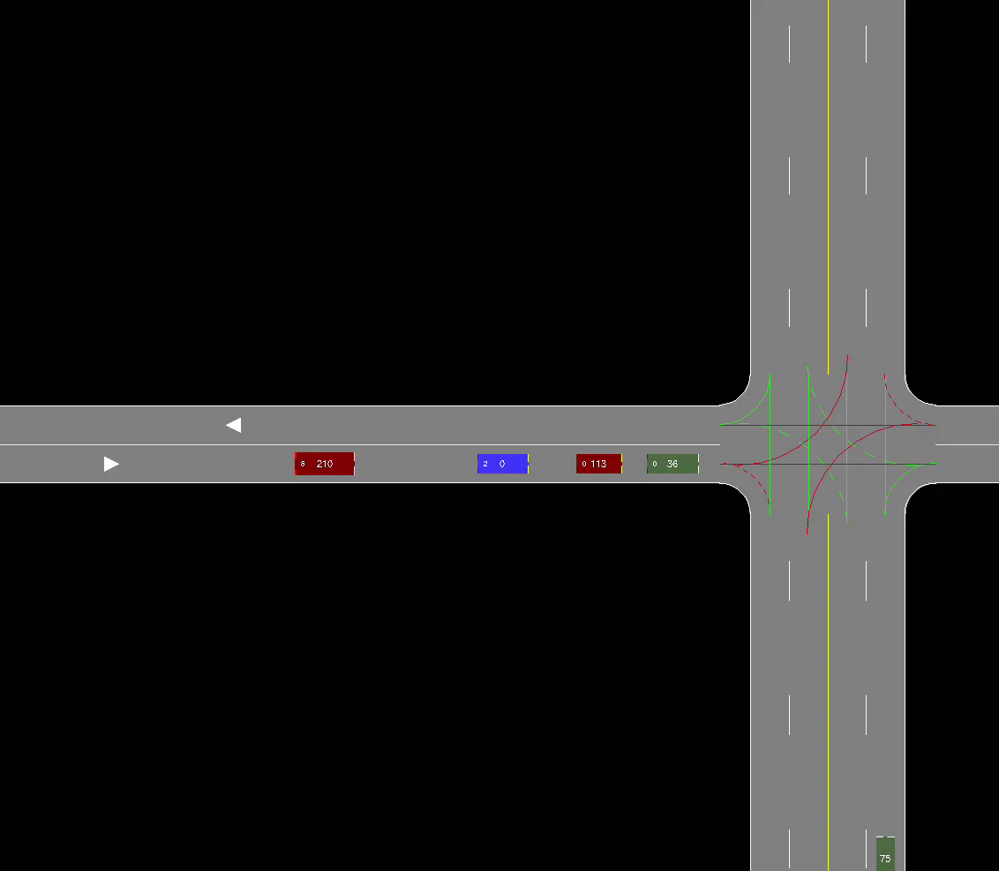

<div style="text-align: center;">
  
</div>

# Awesome 2D AV Simulator

Welcome to the Awesome 2D AV Simulator!

Awesim is a city-scale traffic simulator with typed units, NPC traffic, SDL rendering, and Python bindings that let any C entry point be called from RL or other external controllers—and it can also be used to control the agent car from outside C code, e.g., using RL. The stock Gymnasium environment (AwesimEnv) wraps those bindings so an agent adjusts car 0’s driving-assistant knobs (follow vs stop modes, speed targets, headway buffers, turn/merge intents) while every other vehicle runs the built-in NPC policy; its 149-D observation vector blends vehicle state, ADAS configuration, situational awareness, traffic lights, and fuel/time context for long-horizon driving tasks. Each step advances the real simulator, so policies learn to complete full trips—merging, turning, and obeying intersections—alongside realistic traffic, while the environment tracks multi-term costs (fuel, crash damage, lost wages, time penalties, in-progress traffic-violation costs) suitable for CMDP-style safety and economic constraints. Because the bindings expose the complete C API, you can script your own Gym/MDP wrappers, custom maps, or safety monitors just as easily, making Awesim a flexible platform for research and prototyping.

<div style="text-align: center;">
  
  
</div>
<div style="text-align: center;">
  
</div>


## Installation

First, ensure you have `clang` and the SDL2 libraries installed. On Ubuntu, you can install the necessary dependencies with:

```bash
sudo apt install libsdl2-dev libsdl2-ttf-dev libsdl2-gfx-dev libsdl2-image-dev
```

On macOS, you can use Homebrew:

```bash
brew install sdl2 sdl2_ttf sdl2_gfx sdl2_image
```

On Windows, you would typically use minGW or a similar toolchain. Make sure to install the SDL2 libraries and set up your environment accordingly.

## Running the Simulator

To compile and launch the simulator, run:

```bash
sh scripts/linux/play.sh
```
For macOS, use `sh scripts/mac/play.sh`. For Windows, run `scripts/windows/play.bat`.

To benchmark the number of transitions per second:

```bash
sh scripts/linux/benchmark.sh
```
For macOS, use `sh scripts/mac/benchmark.sh`. For Windows, run `scripts/windows/benchmark.bat`.

## Exploring the Codebase

To understand how the simulator works, begin by reviewing the header files in the `include/` directory in the following order:

1. `utils.h`
2. `logging.h`
3. `map.h`
4. `car.h`
5. `ai.h`
6. `sim.h`
7. `awesim.h`
8. `render.h`

Each header file is implemented in a corresponding folder within the `src/` directory. For example, the `render.h` file is implemented in `src/render/`, with source files like:

- `src/render/render_lane.c`
- `src/render/render_car.c`
- etc.

---

## Python Bindings

To generate bindings, first install swig using `sudo apt install swig` on Linux or `brew install swig` on macOS. On Windows, download the swig installer from the [SWIG website](http://www.swig.org/download.html) or use a package manager like Chocolatey or use [MSYS2](https://www.msys2.org/).

Create a Python virtual environment and install the required dependencies with `pip install -r pyawesim/requirements.txt`. Activate the virtual environment.

Finally, run `sh pyawesim/generate_bindings.sh` (on Linux/macOS) or `pyawesim\generate_bindings.bat` (on Windows) to generate the Python bindings.

See the `pyawesim/gymenv.py` file for an example of how to use the bindings to create a Gymnasium environment. `pyawesim/train.py` provides code to train a PPO agent to solve this environment.

## Todos


## Contributing

Feel free to contribute or report issues. Enjoy simulating!