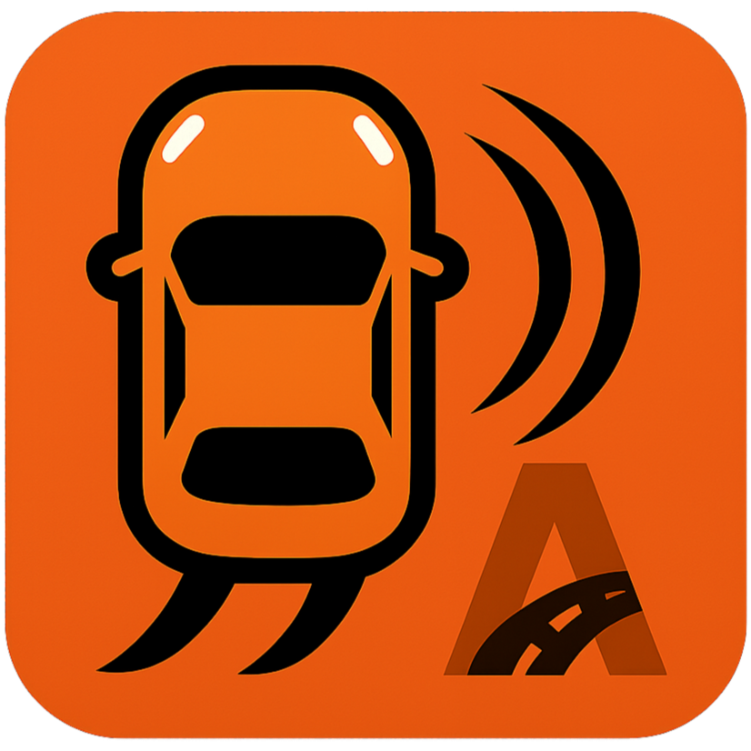
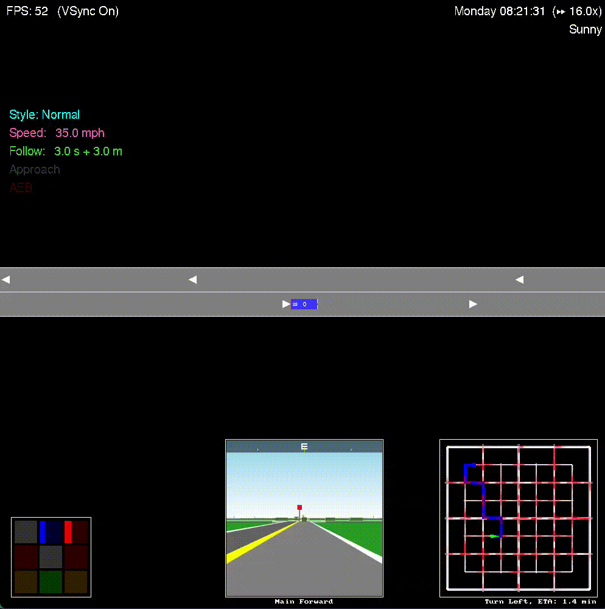

<div style="text-align: center;">
  
</div>

# Awesome 2D AV Simulator

Welcome to the Awesome 2D AV Simulator!

Awesim, written entirely in pure C for high speed and low memory usage, is a city-scale traffic simulator with NPC traffic, traffic-aware real-time path planning, camera and lidar sensors, a city map with different types of intersections, SDL rendering, and Python bindings that let any C function be called externally, which can be used to control the agent car from outside C code, e.g., using RL. A lightweight deep-RL pure C implementation is also included. The stock Gymnasium RL environments have an agent car travel from point A to point B using low-level driving control or optionally via ADAS knobs (follow distance, speed targets, safe merge etc.) while every other vehicle runs the built-in NPC policy; the observations may be inputs from 7 cameras (which the training files process with vision models) or raw access to the ground state of the traffic and intersections (which could be provided to a transformer to re-encode each object in relation to each other). Each step advances the simulator, so policies learn to complete full trips—merging, turning, and obeying intersections—alongside realistic traffic, while the environment tracks multi-term costs (fuel, crash damage, time penalties, and traffic-violation costs) suitable for CMDP-style safety and economic constraints. Because the bindings expose the complete C API, you can script your own Gym/MDP wrappers, custom maps, or safety monitors just as easily, making Awesim a flexible platform for research and prototyping.

<div style="text-align: center;">
  
</div>


## Installation

First, ensure you have `clang` and the SDL2 libraries installed. On Ubuntu, you can install the necessary dependencies with:

```bash
sudo apt install libsdl2-dev libsdl2-ttf-dev libsdl2-gfx-dev libsdl2-image-dev
```

On macOS, you can use Homebrew:

```bash
brew install sdl2 sdl2_ttf sdl2_gfx sdl2_image
```

On Windows, you would typically use minGW or a similar toolchain. Make sure to install the SDL2 libraries and set up your environment accordingly.

## Running the Simulator

To compile and launch the simulator, run:

```bash
sh scripts/linux/play.sh
```
For macOS, use `sh scripts/mac/play.sh`. For Windows, run `scripts/windows/play.bat`.

To benchmark the number of transitions per second:

```bash
sh scripts/linux/benchmark.sh
```
For macOS, use `sh scripts/mac/benchmark.sh`. For Windows, run `scripts/windows/benchmark.bat`.

## Exploring the Codebase

To understand how the simulator works, begin by reviewing the header files in the `include/` directory in the following order:

1. `utils.h`
2. `logging.h`
3. `map.h`
4. `car.h`
5. `ai.h`
6. `sim.h`
7. `awesim.h`
8. `render.h`

Each header file is implemented in a corresponding folder within the `src/` directory. For example, the `render.h` file is implemented in `src/render/`, with source files like:

- `src/render/render_lane.c`
- `src/render/render_car.c`
- etc.

---

## Python Bindings

To generate bindings, first install swig using `sudo apt install swig` on Linux or `brew install swig` on macOS. On Windows, download the swig installer from the [SWIG website](http://www.swig.org/download.html) or use a package manager like Chocolatey or use [MSYS2](https://www.msys2.org/).

Create a Python virtual environment and install the required dependencies with `pip install -r pyawesim/requirements.txt`. Activate the virtual environment.

Finally, run `sh pyawesim/generate_bindings.sh` (on Linux/macOS) or `pyawesim\generate_bindings.bat` (on Windows) to generate the Python bindings.

See the `pyawesim/gymenv.py` file for an example of how to use the bindings to create a Gymnasium environment. `pyawesim/train.py` provides code to train a PPO agent to solve this environment.

## Todos


## Contributing

Feel free to contribute or report issues. Enjoy simulating!
